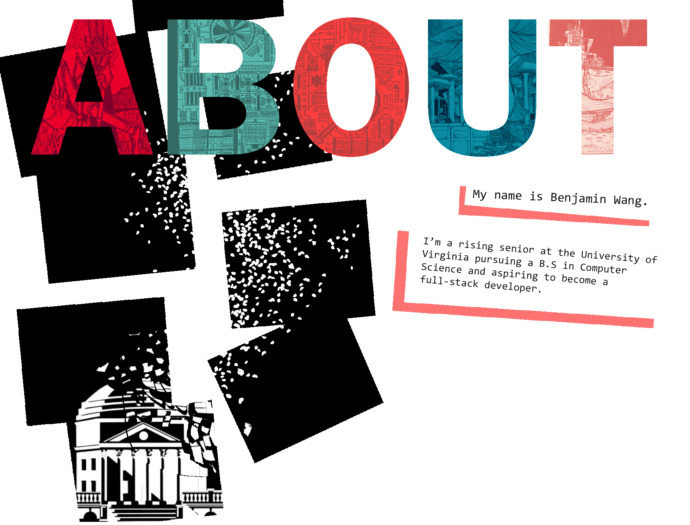
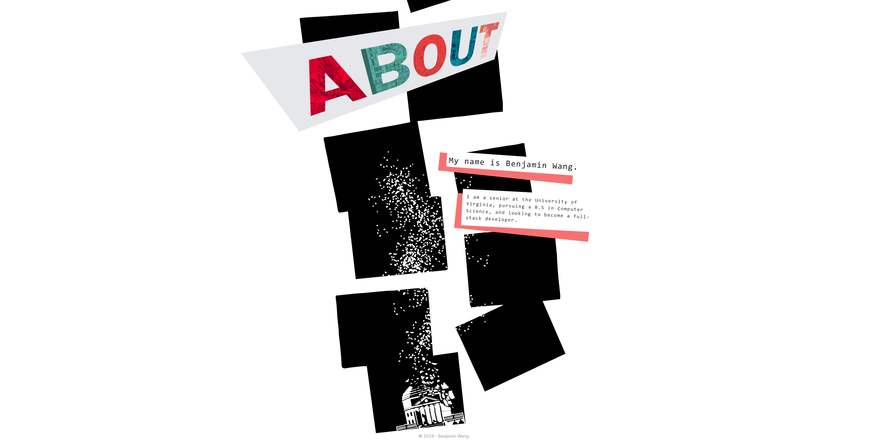
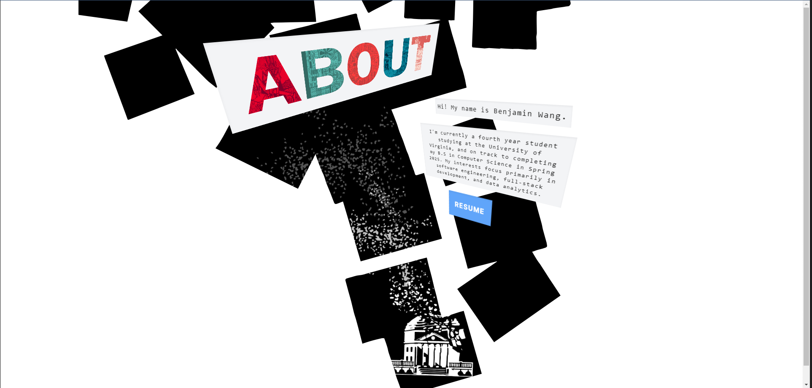
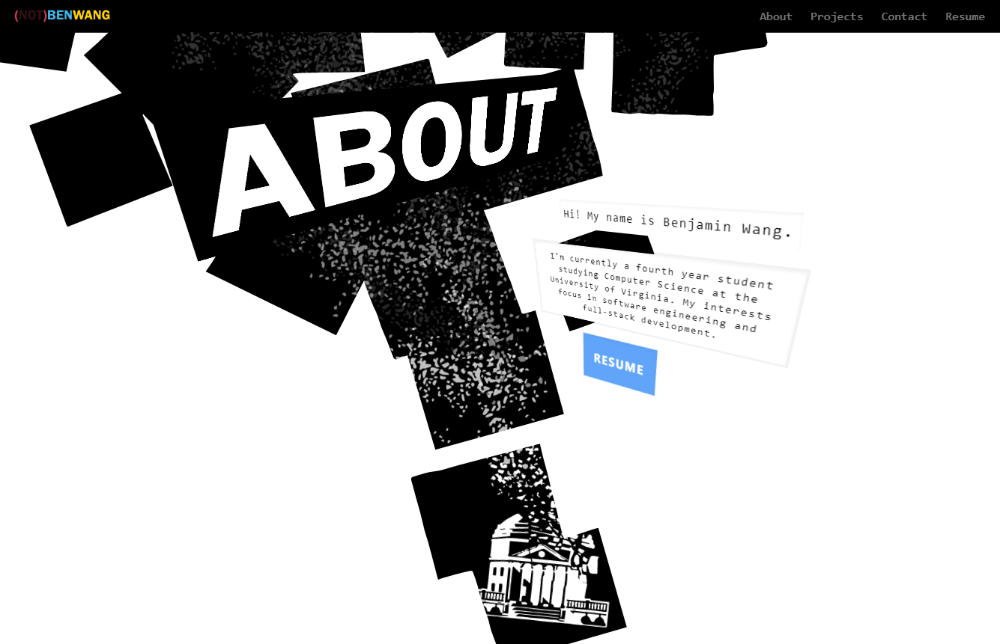
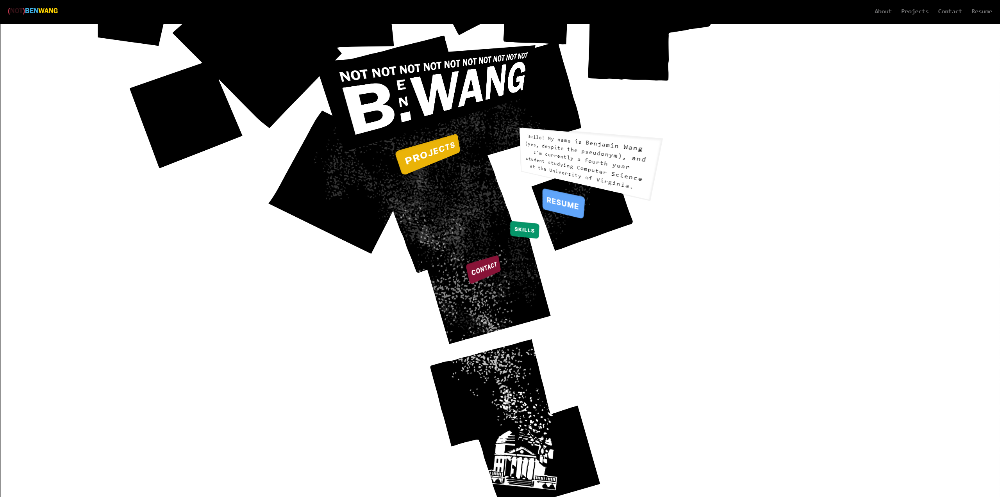
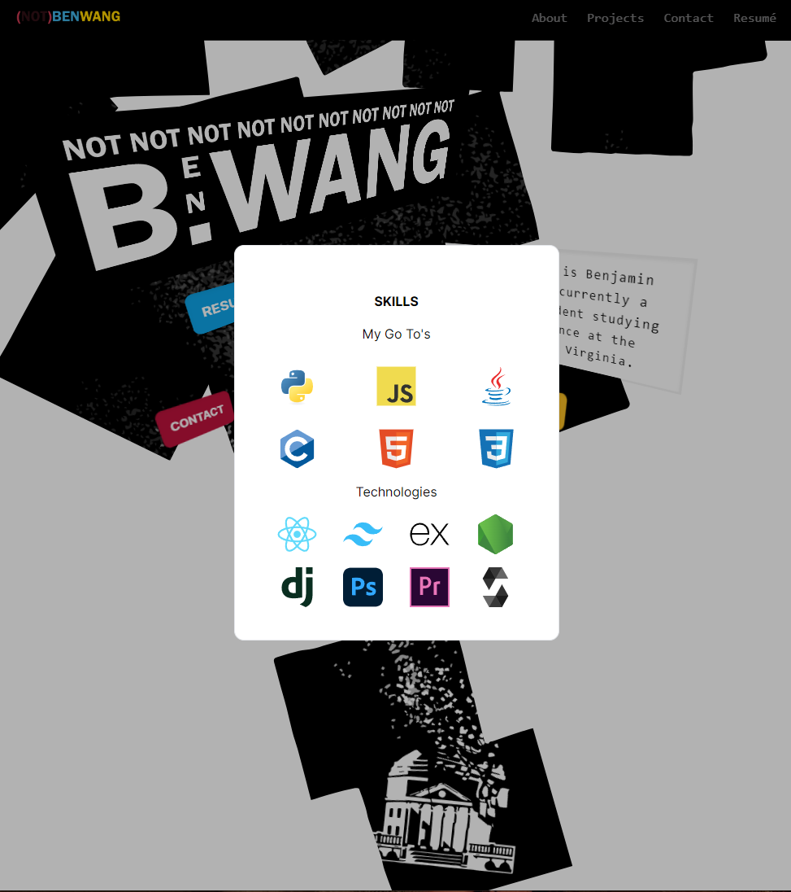

# Portfolio

This is a one page, modal-like portfolio created by Benjamin Wang using React, TailwindCSS, and Next.js during the Summer 2024. [This portfolio](https://notbenwang.github.io/) is regularly maintained,
so any feedback is greatly appreciated, and can be directed either here on Github, or through my email at notbenwang@gmail.com.
## Table of Contents
* [Motivation](#motivation)  
* [Pre-Development](#pre-development)
* [Technologies](#technologies)
* [Developmental Process](#developmental-process)
* [Deployment](#deployment)
* [Review](#review)
* [Conclusion](#conclusion)
## Motivation
This project originally stems from a dissatisfaction
over my previous portfolio, one which you can actually still find deployed [here](https://notbenwang.github.io/old_portfolio/). I think my biggest gripe with it overall was that I have always considered myself a person of creativity, but everytime I looked at my old portfolio, I found the opposite. It felt cold, bleak, and honestly *boring*.

That's why I strove to improve my portfolio, not just to better how I sell myself to other people and employers, but to also prove to myself that I can *do* better. I said to myself that I was going to make a portfolio, not with intentions to make it the cleanest thing ever made, but to really push the boundaries of my own skills and creativity.

The second (and more boring) motivation behind this portfolio was to exercise learning in two main technologies: React and CSS (Tailwind specifically). I always believed that one of my weakest strengths in web development was my frontend capabilities, so I really put to the test strengthening and practicing these skills.

## Pre-Development
When I first made my old portfolio, I had used a template I had found online and changed some of the pictures and text to fit my purposes. While the template I used was honestly really good, this time, I wanted to build the portfolio from the ground up, not just because it gave me more creative freedom, but also because I wanted to learn better how these portfolios truly worked (*and what better way to learn than through implementation*).

The first thing I did was scour the internet  for specific UI designs that I found interesting and that I wanted to incorporate in some ways into my portfolio. The two biggest inspirations I found were the Persona games and the designs of David Carson. I think if you look at their work, and then compare it to my portfolio, the inspiration becomes pretty clear.

With this palette of design in my mind, I then came up with a mock-up design layout sketch of the portfolio using Photoshop. 

While the end result came out quite a bit differently, I found three things have managed to survive to the final portfolio. 
1. The dissolving Rotunda as the main visual centerpiece of the portfolio
2. The abstract, almost ethereal white background with black squares to reveal windows into the visual centerpiece
3. A large font-based title to act as a secondary catch to the eye

So with a visual style in mind and a draft made, I began work with actually implementing this image into code.

## Technologies
As stated at the very top, this portfolio was created using three main technologies: React, TailwindCSS, and Next.js. Here, I will go more in depth with why I chose these three technologies.
- **React**: In terms of web development, I don't think there's a more vital skill that any front-end engineer could know. What's a bit embarassing to say is that throughout my almost four years of programming, I have had minimal experience in the technology, so I made it a defining point to learn the basics of React through this project.
- **TailwindCSS**: I'll be honest; if I had barely scratched the surface on React, I had been actively avoiding working with any forms of CSS. I'm sure most programmers have that one popular technology that they avoid, and for me, it was just CSS; I hated how it looked, the weird syntax around it, etc. But, if I wanted to create front-end oriented like this portfolio, then there was no way I could avoid CSS this time. I chose Tailwind specifically because it allowed me to work with CSS within the React files, and also with certain VSC extensions, made it a quicker way for me to learn the different CSS styles.
- **Next.js**: I wanted to use some sort of React-based framework, and when looking for some of the most popular ones within the web development sphere, Next.js came up. While I didn't need to go that in depth into Next.js for the development of this portfolio, a main appeal of Next.js for me was its page layouts, which I found a lot easier and simpler in terms of routing when compared to native React.

## Developmental Process
The main development process (starting from nothing and reaching the deploy stage) took around five days.

### Day 1 | Basic Layout
Day 1 defined by learning Tailwind CSS and creating the basic layout structure of the site. At this point, everything was static; essentially a bunch of pictures stacked upon each other.

### Day 2 | Animations
Day 2 was defined by animating the static images to make it feel more dynamic, like the main "ABOUT" title and the dissolving rotunda. I worked for a while to implement the visual center piece in the likeness to the draft and what I imagined in my head. I'm very proud with how it ended up, as the animated effect has remained almost unchanged since then. 

### Day 3 | NavBar + Design Changes
Day 3 was defined through the addition of the navigation bar and an early implementation of the "About" modal. I also made design changes to the "About" title; I was never sold on the colored version, choosing to ultimately go with a monochromatic color scheme instead. I think it works well, as the black box helps blend the title with the black windows in the background, which adds to the minimalist theme that I was going for.

### Day 4 | Title Change + Buttons
Day 4 I finally changed the title card to the one seen in the final product, which calls back to the "NotBenWang" pseudonym of my github. I also added four buttons that would open one of four modals, of which you can see from the Navigation Bar. I was never happy with the placement of these buttons, which is a reoccuring theme over the development process.

*If you're wondering where the "notbenwang" pseudonym came from, it originated all the way back in middle school as I was brainstorming ways to be able to have the username "benwang" for my social media accounts. It just so happens that "notbenwang" is often an uncommon username, and I've kept with it ever since.*

### Day 5 | Modal Implementations
Day 5 I worked and finished the modals. I struggled quite a bit implementing these, but eventually found MaterialUI, which made implementation of the modals quite a bit easier.

### Post Day 5 | Adjustments
After the initial five day development period, I essentially had all the functionality implemented that I wanted for the portfolio website. All that was left for the following couple of days were to tinker and adjust with some of the spacing, layout, and design choices (i.e button layout, colors, etc).

## Deployment
I chose to deploy this portfolio using Github Pages, as it was the same method I had used to deploy my old portfolio, and because there were plenty of resources online for how to deploy Next.js applications onto Github Pages. Deployment to Github Pages went rather smoothly, as Github already supplies a .yml file for Next.js applications; all I had to do was tinker with a bit of the settings to make the application a static build and everything was online.

## Review
There are a lot of things I want to say when reviewing this project. For one, it was a lot shorter than some of my other projects, which can take weeks, months, or sometimes even years to even see fruition; it was honestly managed very well and I'm very proud of what I was able to accomplish so much in just a week.

In terms of meeting my goals, I think I succeeded. While I can be a nitpicky on some of the design decisions, I think that the overall atmosphere and theme was executed to a fairly well degree; while not a perfect one to one representation of what I thought of in my head, it's a close enough representation that I am satisfied with. In terms of the code and implementation, I think I succeeded in how I was able to excercise my skills in front-end development; it's not exactly my forte but I really think this experience working with React and TailwindCSS has improved my skills not only in front-end but as a web developer. It was nice to experiment on hands with CSS and see why sometimes things wouldn't work how I would, but also because of that, I think there might be some janky implementations for some of the aspects that might need to be changed in the future.

Overall, the project's not perfect (none really are in my eyes), but I think there's a lot of *me* in it, and that's ultimately what I was trying to go for in my motivation, so I'm happy that it reflects here. It also probably helps that I think it's miles ahead better than when I had before, so there's that.

In the future, I would like to add some support for mobile devices when viewing the website. I have some plans on how I would do it, but implementing them would take some time; time that I think would be better suited for other types of projects. But in the future, when I have some more time? For sure.

## Conclusion
If you've read this far, then thank you! I put a lot of work into this portfolio and ReadMe, so I really appreciate you sticking around and giving it a read. If there are any mistakes, have any feedback/critiques on the portfolio, or just want to reach out to me, don't hesitate to email me at notbenwang@gmail.com.
